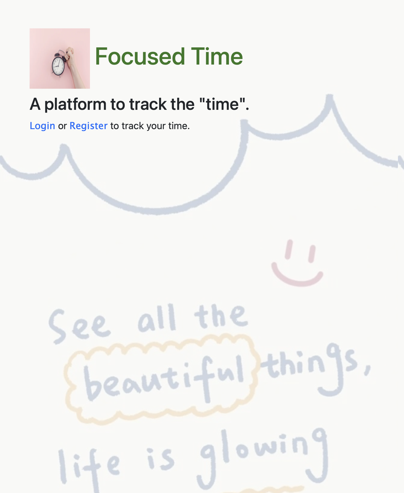
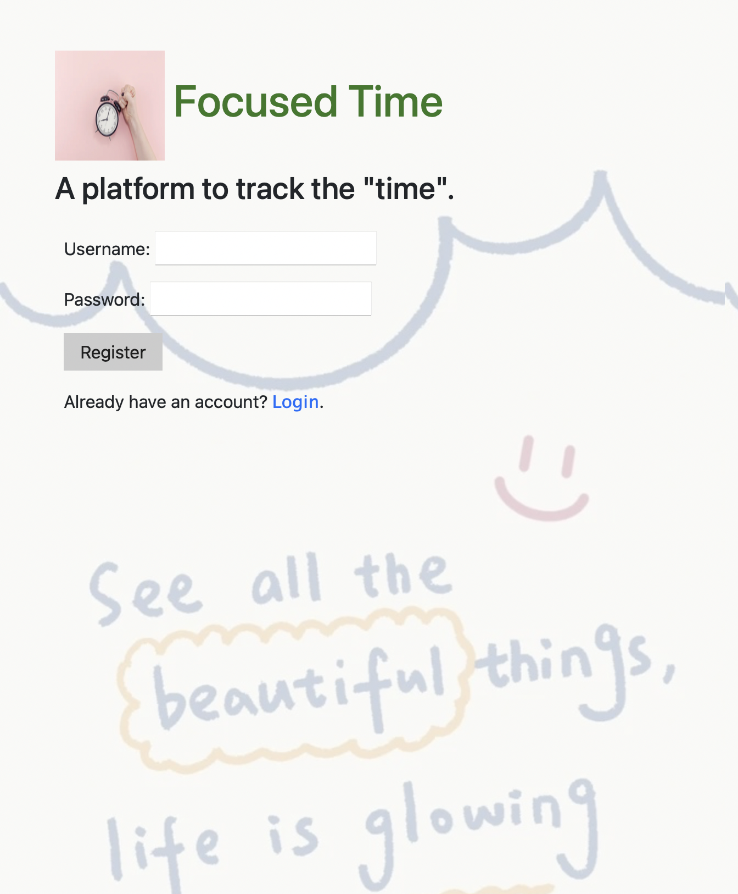
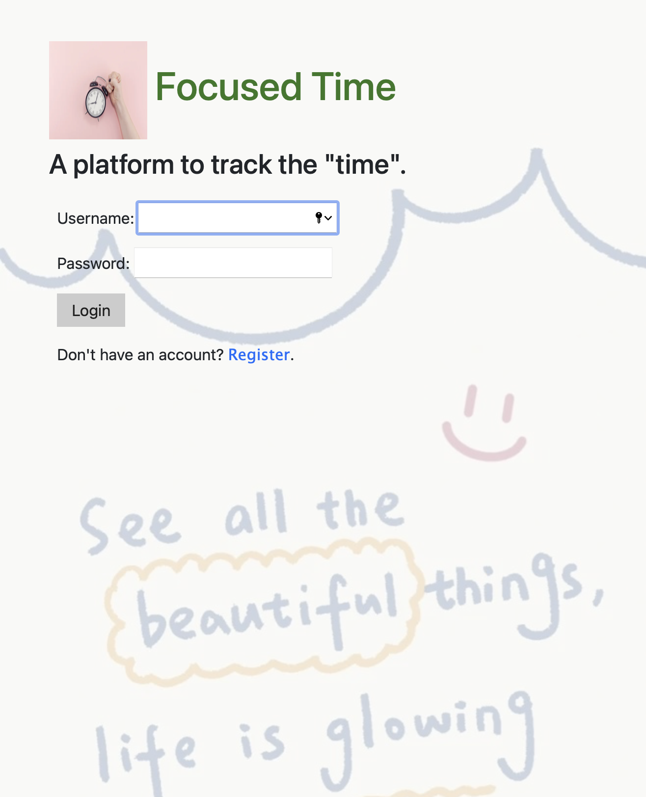
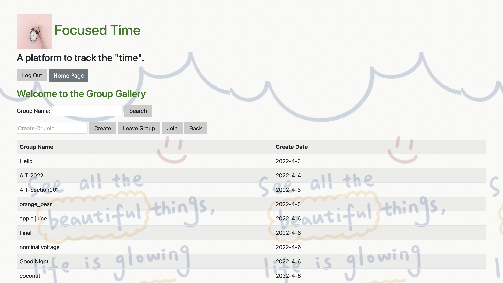
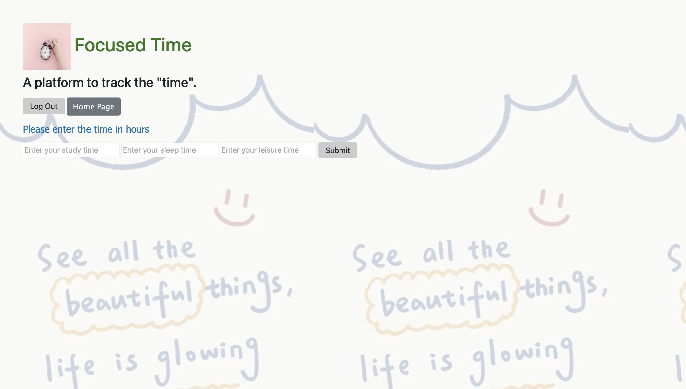
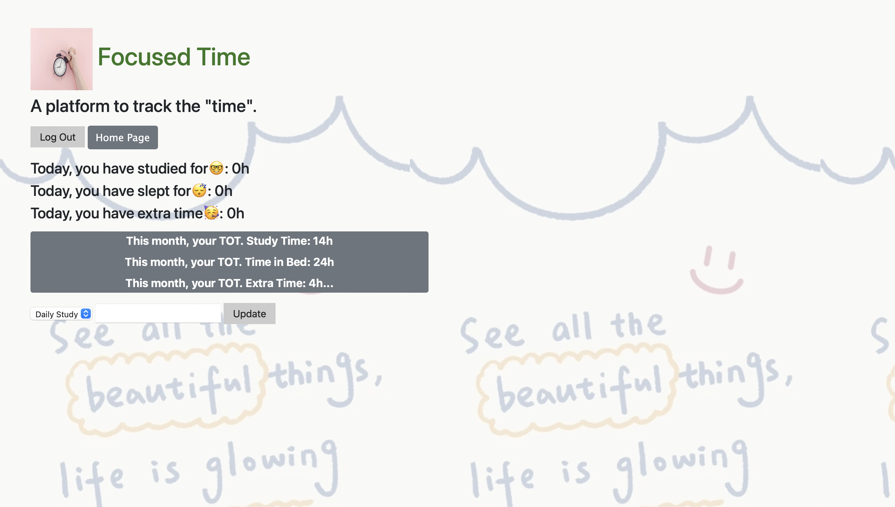
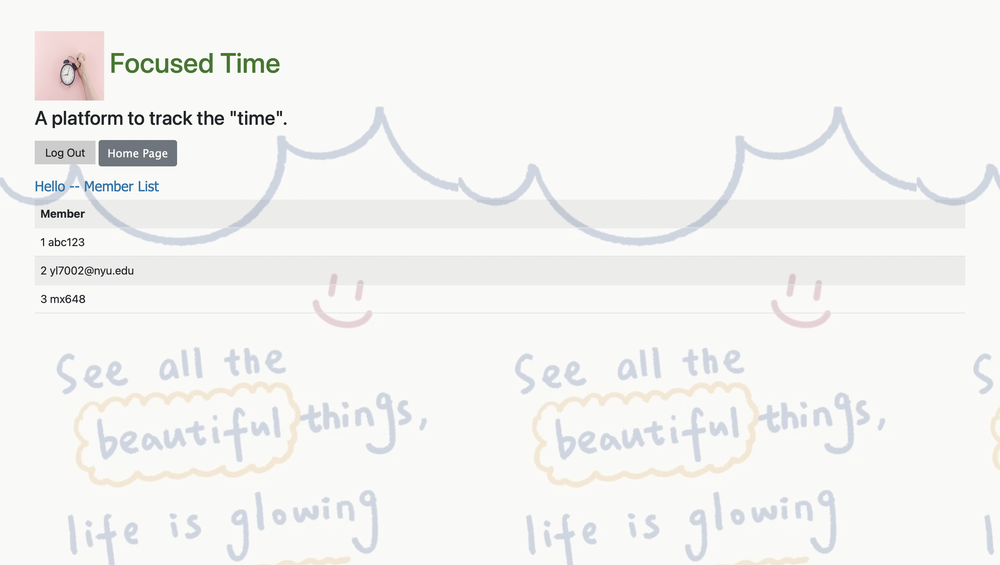

The content below is an example project proposal / requirements document. Replace the text below the lines marked "__TODO__" with details specific to your project. Remove the "TODO" lines.


# Focused Time

## Overview

Tracking the intensity of focus every day motivates users to adjust their daily schedule properly.

Focused Time is a web app that allows users to keep track of their everyday sleep, study/work, and leisure time. Then the app will collect those daily data and present a monthly report. For building up small communities for users, each user can choose to either join in or create a unique group. One user can only choose one group. However, leaving a group at any time is free, and re-choose a new one instead.


## Data Model


The application will store Users, Groups and Info(information of user)

* users have their own information (via references)
* each group can have multiple users (by embedding)


An Example User:

```javascript
{
  username: "mx648",
  hash: // a password hash,
  information: // the reference to Info document
  }
```

An Example Info:

```javascript
{
  "_id":{"$oid":"623b660d873c1908f364b309"},
  "user"://the reference to User document,
  "date":{"$date":"2022-03-23T04:00:00.000Z"},
  "month":3,
  "dailyStudy":6.5,
  "dailySleep":8,
  "dailyLeisure":2,
  "monthlyStudy"://sum of daily Study in one month,
  "monthlySleep"://sum of daily Sleep in one month,
  "monthlyLeisure"://sum of daily Leisure in one month,
  "groupID":"AIT",// the group that the user joined
  "joinGroup":true //check the user whether has already been in a group or not
  }
```
An Example Group:

```javascript
{
  createdAt: 2022-3-23// date
  groupID: "AIT",
  member: ["mx648",...]// the list of member's username 
  avgStudy: // the average monthly study time
  avgSleep:// the average monthly sleep time
  avgLeisure:// the average monthly leisure time
  }
```
An Example List:
```javascript
const List = new mongoose.Schema({
  groups:[{type:String}],
  listID:{type:String,required:true}
});
```

## [Link to Commented First Draft Schema](db.js) 


## Wireframes


/user - page for home browser (before logged in)

/user - page for home browser (after logged in)

/user/create - page for creating a new account

/user/login - page for log in

/user/group - page for the group that user belongs to, and user can choose whether to leave or not.

/list/record - page for recording everyday study/work, sleep, leisure time

/list/report - page for showing monthly data, and the data that compared with the previous day

/group - page for showing some exsiting group names, and for searching and joining.

/list/groupReport - page for showing the group member list



## Site map


## User Stories or Use Cases

Usecase Diagram:


## Research Topics


* (5 points)Integrate Authentication 
    * It is used to validate the password, username and group id.
    * The username and group id should be unique, and the username should be matched with its password correctly.
    * I will use passport as authentication middleware to verify password, username and group id.
* （3 points）Heroku + MongoDB Atlas
    * It is used to deploy my app on Heroku server which allows all peole to use my app.
    * If I provide a link created from Heroku, people from anywhere can open my app.
    * I will use heroku git as my deployment method

* (2 points) Use a CSS framework
    * Fasten the web design
    * I will use Bootstrap to implement the layout of web pages instead of writing redundant stuff in original css files.


## [Link to Initial Main Project File](app.js) 

## Annotations / References Used

1. [complete auth.js based on passport.js docs](https://www.passportjs.org/tutorials/password/)
2. [Heroku tutorial](https://devcenter.heroku.com/articles/deploying-nodejs#provision-a-database)
3. [MoongoDB Atlas tutorial](https://www.mongodb.com/developer/how-to/use-atlas-on-heroku/)
4. [tutorial on Bootstrap](https://getbootstrap.com/docs/5.1/getting-started/introduction/) 
